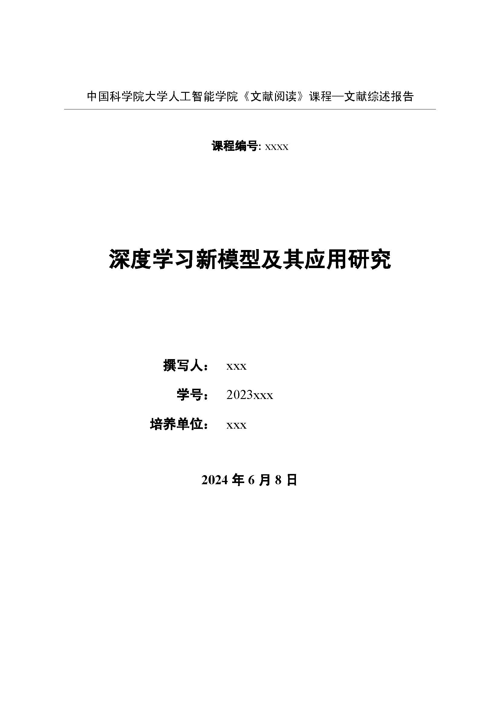
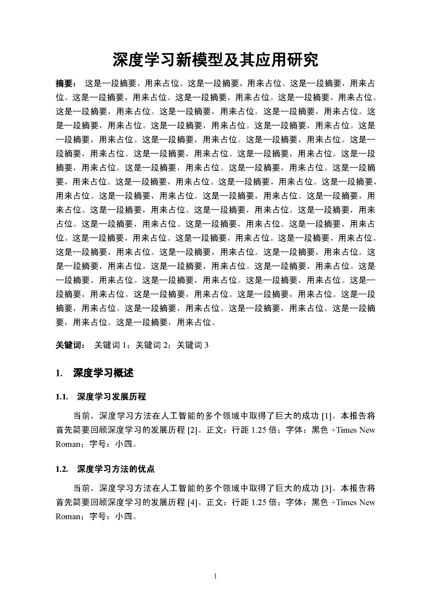
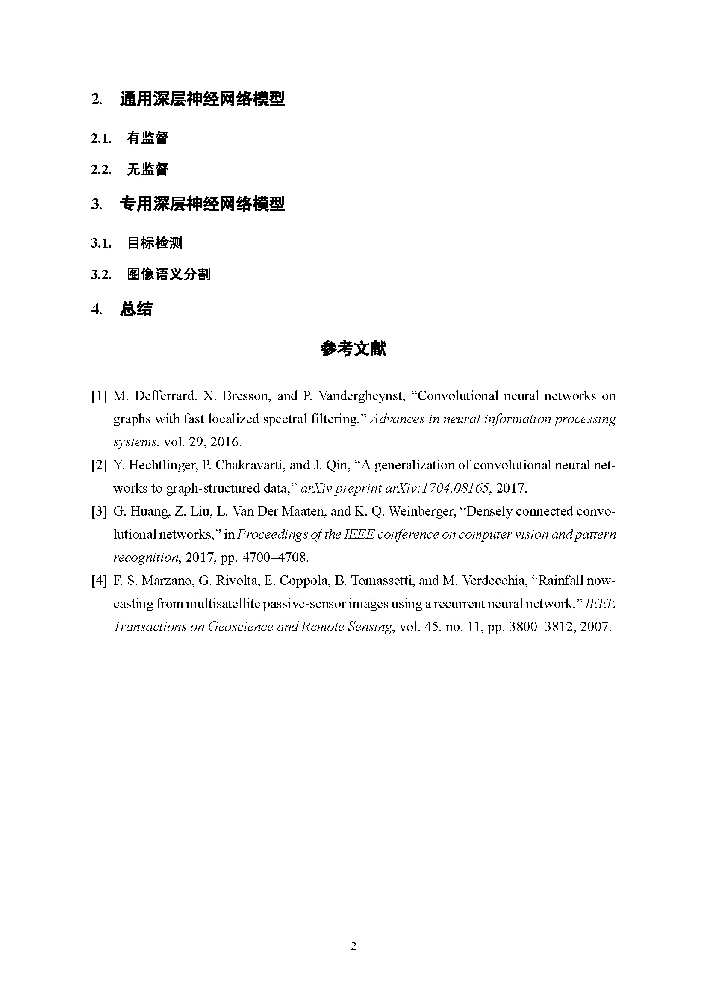

# 国科大文献阅读报告LaTeX模板

## 预览

## 食用指南

将项目上传至overleaf后，设置Compiler为XeLaTeX即可编译。请自行补充`\mytitle`, `\author`, `\courseID`, `\studentID`, `\organization`等信息。

文档排版相关信息在`config.tex`中设置。

如有任何问题，欢迎提issue或者PR。